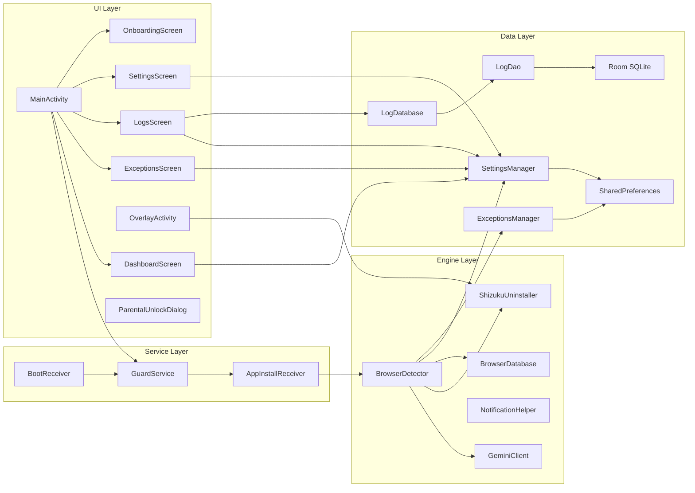
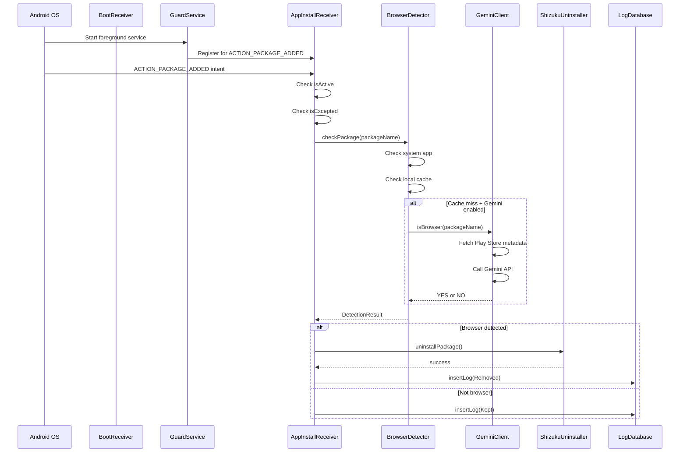
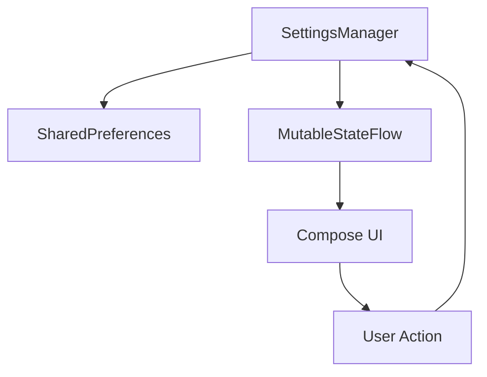

# Architecture

Browser Limit follows a single-module architecture with Jetpack Compose for the UI layer, Room for persistence, and Shizuku for system-level operations. The app uses a reactive data flow pattern with SharedPreferences wrapped in `MutableStateFlow`.

## High-Level Architecture



## Module Structure

Browser Limit is a single-module Android project. All code resides in the `app` module under the `com.example` namespace.

```
app/src/main/java/com/example/
├── MainActivity.kt              # Entry point, navigation, lock screen
├── data/
│   ├── SettingsManager.kt       # SharedPreferences wrapper
│   ├── ExceptionsManager.kt     # Exception list management
│   ├── LogEntry.kt              # Room entity
│   ├── LogDatabase.kt           # Room database singleton
│   └── LogDao.kt                # Database queries
├── engine/
│   ├── BrowserDetector.kt       # Detection orchestrator
│   ├── BrowserDatabase.kt       # Known browser package list
│   ├── GeminiClient.kt          # Gemini API client
│   ├── ShizukuUninstaller.kt    # Shizuku uninstall wrapper
│   └── NotificationHelper.kt    # Notification posting
├── service/
│   └── GuardService.kt          # Foreground service
├── receiver/
│   ├── AppInstallReceiver.kt    # Package install handler
│   └── BootReceiver.kt          # Boot completion handler
└── ui/
    ├── dashboard/DashboardScreen.kt
    ├── exceptions/ExceptionsScreen.kt
    ├── logs/LogsScreen.kt
    ├── settings/SettingsScreen.kt
    ├── overlay/OverlayActivity.kt
    ├── onboarding/OnboardingScreen.kt
    ├── components/ParentalUnlockDialog.kt
    └── theme/
        ├── Color.kt
        ├── Theme.kt
        └── Type.kt
```

## Data Flow

### App Installation Detection



### Settings Data Flow



All settings are exposed as `StateFlow` objects. The Compose UI collects these flows using `collectAsState()`. When a setting changes, the new value is written to SharedPreferences and the StateFlow is updated, triggering a recomposition.

## Key Components

### MainActivity

- Entry point for the application.
- Handles splash screen via `installSplashScreen()`.
- Manages the lock screen (parental lock) via `LockScreen` composable.
- Sets up Compose Navigation with 4 tabs: Dashboard, Exceptions, Logs, Settings.
- Starts the GuardService if Browser Limit is active.
- Registers a lifecycle observer that re-engages the lock screen when the app goes to background.

### GuardService

- Foreground service that runs while Browser Limit is active.
- Registers `AppInstallReceiver` for `ACTION_PACKAGE_ADDED` events.
- Displays a persistent notification with "Browser Limit is active/paused" and a Pause/Resume action.
- Uses `START_STICKY` to ensure the service restarts if killed.

### AppInstallReceiver

- BroadcastReceiver that handles `ACTION_PACKAGE_ADDED` events.
- Checks if Browser Limit is active.
- Checks if the package is in the exceptions list.
- Calls `BrowserDetector.checkPackage()` for classification.
- Launches `OverlayActivity` or calls `ShizukuUninstaller` based on the detection mode.
- Logs the result to the Room database.

### BootReceiver

- BroadcastReceiver that handles `BOOT_COMPLETED` and `LOCKED_BOOT_COMPLETED` events.
- Starts the GuardService if "Run on device startup" is enabled.

### OverlayActivity

- Full-screen translucent activity shown when a browser is detected in overlay mode.
- Displays a countdown timer with the detected app's name and reason.
- Two buttons: "Remove Now" (immediate uninstall) and "Keep & Add Exception" (skip and add to exceptions).
- Auto-removes the app when the countdown expires.

### BrowserDetector

- Orchestrator for the detection flow.
- Checks system apps, local cache, Gemini API, and fallback database.
- Returns a `DetectionResult` with classification, method, and reason.

### GeminiClient

- Retrofit client for the Gemini Flash Lite API.
- Fetches Play Store metadata for the detected app.
- Sends a classification prompt and parses the YES/NO response.
- Handles HTTP errors with retry logic for rate limiting (429).

### ShizukuUninstaller

- Wraps the Shizuku API for rootless package uninstallation.
- Checks if Shizuku is running before attempting removal.
- Calls `ShizukuHelper.uninstall(packageName)`.

### SettingsManager

- Centralized settings store using SharedPreferences.
- All settings are exposed as `MutableStateFlow` for reactive UI updates.
- Manages Gemini API counters and daily limits.
- Manages confirmed browser/non-browser caches.

### ExceptionsManager

- Manages the exceptions list using a JSON array in SharedPreferences.
- Pre-populates with two permanent exceptions.
- Exposes an observable `StateFlow<List<String>>`.

### LogDatabase / LogDao

- Room database for the audit log.
- Single table `logs` with `LogEntry` entity.
- Provides Flow-based queries for real-time UI updates.
- Auto-trims to 500 entries on each insert.

## Technology Stack

| Layer | Technology |
|---|---|
| **UI** | Jetpack Compose, Material 3 |
| **Navigation** | Compose Navigation |
| **State Management** | MutableStateFlow + collectAsState |
| **Persistence** | SharedPreferences, Room |
| **Networking** | Retrofit + OkHttp + kotlinx-serialization |
| **DI** | None (manual singletons) |
| **Animations** | Lottie Compose |
| **System APIs** | Shizuku 13.1.5 |
| **AI** | Google Gemini Flash Lite |
| **Build** | Gradle (Kotlin DSL), KSP |
| **Testing** | JUnit 4, Roborazzi |
