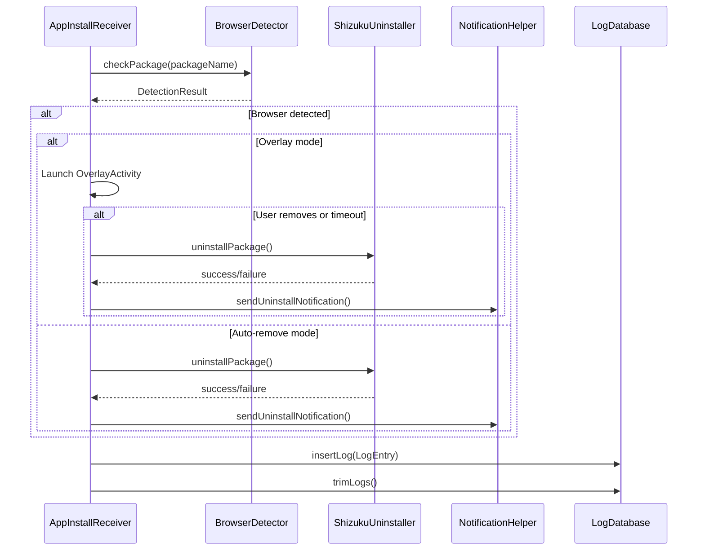

# Audit Log System

Browser Limit maintains a complete audit trail of every detection decision, AI classification, and uninstallation attempt. The log is stored in a local Room database and can be viewed, searched, and exported.

## Database Schema

The log is stored in a Room database named `browserlimit_logs` with a single table `logs`.

### LogEntry Entity

| Column | Type | Description |
|---|---|---|
| `id` | `Int` (auto-generated primary key) | Unique log entry identifier |
| `timestamp` | `Long` | Unix timestamp in milliseconds |
| `appName` | `String` | Human-readable app name from PackageManager |
| `packageName` | `String` | Android package name |
| `detectionMethod` | `String` | How the app was classified |
| `decision` | `String` | What action was taken |
| `geminiResponse` | `String` | Detection reason or Gemini API response |
| `shizukuResult` | `String` | Shizuku uninstallation result (currently unused) |

### Decision Values

| Decision | Meaning |
|---|---|
| `Removed` | App was classified as a browser and uninstalled |
| `Kept` | App was classified as a non-browser |
| `Excepted` | App was found in the exceptions list and skipped |
| `Error` | Uninstallation was attempted but failed |

### Detection Method Values

| Method | Meaning |
|---|---|
| `Gemini` | Classified by Gemini API |
| `Gemini (Recheck)` | Rechecked via Gemini from the Logs screen |
| `Local Cache` | Found in the local confirmed browsers/non-browsers cache |
| `Local` | Found in the `KNOWN_BROWSERS` database |
| `Fallback (Error: ...)` | Gemini failed, fell back to local database |
| `System App` | Skipped because it is a system app |
| `Settings` | Skipped because Browser Limit is inactive |

## Log Entry Lifecycle



## Viewing Logs

The **Logs** screen displays all log entries in reverse chronological order (newest first). Each entry shows:

- App name and package name
- Decision (color-coded: red for Removed, green for Kept, yellow for Excepted)
- Detection method
- Detection reason

### Log Details

Tap any log entry to open the details dialog, which shows:

- Timestamp (formatted as `yyyy-MM-dd HH:mm:ss`)
- Package name
- Decision and method
- Detection reason

For Gemini-classified entries, the details also show:

- The exact prompt sent to Gemini
- The raw Gemini output
- The Shizuku uninstallation command and result

### Rechecking with Gemini

Each log entry has a "Recheck with Gemini" button. This:

1. Clears the local cache for that package.
2. Re-runs the full detection flow with Gemini (even if the daily limit is reached).
3. If the app is reclassified as a browser, it is uninstalled.
4. A new log entry is created with the recheck result.

:::note
Rechecking bypasses the daily Gemini limit. Use it sparingly.
:::

## Exporting Logs

### Bulk Export

Tap **Export** on the Logs screen to export all log entries to a text file:

```
1717200000000 | Chrome (com.android.chrome) | Removed | Gemini - Gemini returned YES
1717199000000 | Firefox (org.mozilla.firefox) | Kept | Local Cache - User overrides
```

The file is saved to the Downloads folder as `browserlimit_logs_{timestamp}.txt`.

If the Downloads folder is not accessible, the file is saved to the app's external files directory.

### Individual Export

In the log details dialog, tap **Export Log** to export a single entry with full details:

```
App Name: Chrome
Package Name: com.android.chrome
Time: 2024-01-15 14:30:00
Decision: Removed
Method: Gemini
Reason: Gemini returned YES
```

## Retention

The log database automatically trims entries to the most recent 500. This happens after every new log entry is inserted.

```sql
DELETE FROM logs WHERE id NOT IN (
    SELECT id FROM logs ORDER BY timestamp DESC LIMIT 500
)
```

To clear all logs manually, tap **Clear** on the Logs screen.

## Dashboard Statistics

The Dashboard screen shows two real-time counters:

| Metric | Query |
|---|---|
| **Scanned Today** | Count of all log entries where `timestamp >= todayStart` |
| **Removed Today** | Count of log entries where `decision = 'Removed'` AND `timestamp >= todayStart` |

Both counters update in real-time using Room Flow queries.
