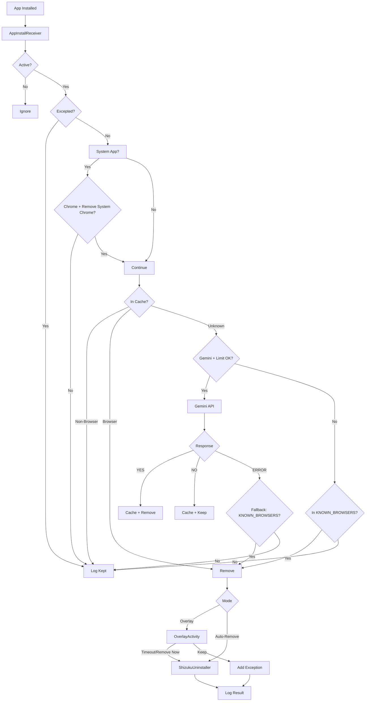

# Detection System

Browser Limit uses a two-tier detection architecture to classify newly installed applications as browsers or non-browsers. The system is designed to be accurate, fast, and resilient to network conditions.

## Overview

When a new app is installed on the device, the detection engine evaluates it through a series of checks. If the app is classified as a browser, it is either removed or presented for confirmation depending on your configuration.



## Detection Flow

The `BrowserDetector.checkPackage()` method is the core of the detection engine. Here is the exact order of checks:

### 1. System App Check

System apps are never removed unless:
- The app is Chrome (`com.android.chrome`), **and**
- The "Remove Chrome (even if system app)" setting is enabled.

All other system apps are immediately classified as non-browsers.

### 2. Local Cache Check

Before making any API calls, the engine checks two local caches:

| Cache | Source | Behavior |
|---|---|---|
| `geminiConfirmedNonBrowsers` | Previous Gemini responses | App is classified as non-browser. Skips Gemini. |
| `geminiConfirmedBrowsers` | Previous Gemini responses | App is classified as browser. Proceeds to removal. |
| `KNOWN_BROWSERS` | Hardcoded in `BrowserDatabase.kt` | App is classified as browser. Proceeds to removal. |

The cache check is skipped when `forceRecheck = true` (used by the "Recheck with Gemini" button in the Logs screen).

### 3. Gemini AI Classification

If Gemini is enabled and the daily limit (20 requests/day) has not been reached, the engine sends a classification request to the Gemini API. See [Gemini AI Integration](gemini.md) for details.

### 4. Fallback Classification

If Gemini is disabled, the daily limit is reached, or the API returns an error, the engine falls back to the local `KNOWN_BROWSERS` database. If the package name is in the list, it is classified as a browser. Otherwise, it is classified as a non-browser.

## Known Browser Database

Browser Limit maintains a hardcoded database of 50+ known browser package names in `BrowserDatabase.kt`. This database serves as the primary classification source when Gemini is unavailable and as a fallback when the API returns errors.

The database includes all major browsers and their variants:

| Browser | Package Names |
|---|---|
| Chrome | `com.android.chrome`, `com.chrome.beta`, `com.chrome.dev`, `com.chrome.canary` |
| Firefox | `org.mozilla.firefox`, `org.mozilla.firefox_beta`, `org.mozilla.fenix`, `org.mozilla.focus` |
| Brave | `com.brave.browser`, `com.brave.browser_beta`, `com.brave.browser_nightly` |
| Edge | `com.microsoft.emmx`, `com.microsoft.emmx.beta` |
| Opera | `com.opera.browser`, `com.opera.mini.native`, `com.opera.gx`, `com.opera.touch` |
| Samsung Internet | `com.sec.android.app.sbrowser`, `com.sec.android.app.sbrowser.beta` |
| Vivaldi | `com.vivaldi.browser`, `com.vivaldi.browser.snapshot` |
| UC Browser | `com.UCMobile.intl`, `com.uc.browser.en` |
| DuckDuckGo | `com.duckduckgo.mobile.android` |
| Tor Browser | `org.torproject.torbrowser` |
| Kiwi | `com.kiwibrowser.browser` |
| Yandex | `com.yandex.browser`, `com.yandex.browser.lite` |
| Via | `mark.via.gp`, `mark.via` |
| Xiaomi Browser | `com.mi.globalbrowser` |
| Lightning | `acr.browser.lightning`, `acr.browser.barebones` |
| Bromite/Cromite | `org.bromite.bromite`, `org.cromite.cromite` |
| Aloha | `com.alohabrowser.aloha` |
| Maxthon | `com.maxthon` |
| Puffin | `com.cloudmosa.puffin` |
| Ecosia | `com.ecosia.android` |
| Avast | `com.avast.android.browser` |
| Ghostery | `com.ghostery.android.ghostery` |
| Phoenix | `com.phoenix.bm` |
| Nox | `com.nox.browser` |
| Tunny | `mobi.mgeek.TunnyBrowser` |
| Quetta | `com.quetta.browser` |
| Waterfox | `net.waterfox.android.release` |
| Cake | `com.cake.browser` |
| Stargon | `com.stargon.browser` |

:::note
This list is not exhaustive. For apps not in this list, Gemini AI provides semantic classification. You can view the full list in the app by going to Settings and tapping "View local browser list".
:::

## Detection Result

Each classification returns a `DetectionResult` data class:

```kotlin
data class DetectionResult(
    val isBrowser: Boolean,   // Whether the app is classified as a browser
    val method: String,       // How it was classified: "Gemini", "Local Cache", "Local", "System App", etc.
    val reason: String        // Human-readable explanation
)
```

Examples of `reason` values:

- `"Found in local known browsers list"`
- `"Gemini returned YES"`
- `"Gemini returned NO (parsed)"`
- `"Ignored: System App"`
- `"Not found in local list"`

## Caching Behavior

Gemini classification results are cached to reduce API calls:

- **Browser results** are stored in `geminiConfirmedBrowsers` (SharedPreferences StringSet).
- **Non-browser results** are stored in `geminiConfirmedNonBrowsers` (SharedPreferences StringSet).
- **Cache clearing** -- The "Recheck with Gemini" button in the Logs screen clears the cache for a specific package and re-runs the full detection flow.

:::caution
The cache persists indefinitely. If a Gemini classification is incorrect, you must manually recheck the app from the Logs screen to clear the cached result.
:::

## Action After Detection

When an app is classified as a browser:

| Mode | Action |
|---|---|
| **Overlay** | Launches `OverlayActivity` with a countdown timer. Shows the app name, package name, detection reason, and two buttons: "Remove Now" and "Keep & Add Exception". If the timer expires, the app is automatically removed. |
| **Auto-Remove** | Immediately calls `ShizukuUninstaller.uninstallPackage()` to remove the app. A notification is posted with the removal details. |

In both cases, the result is logged to the Room database.
