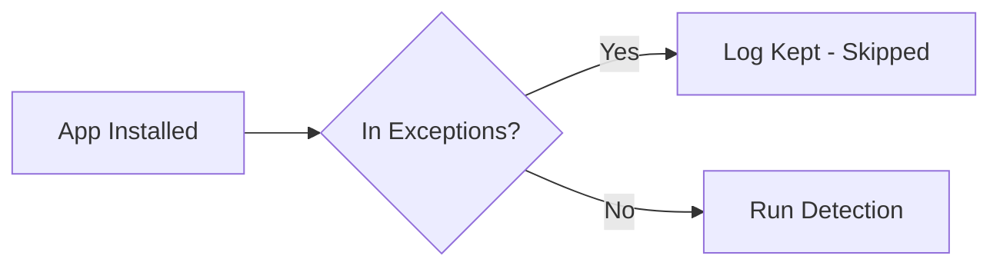

# Exception Management

Browser Limit allows you to exempt specific apps from browser detection and removal. The exceptions list is managed through the Exceptions screen and is checked before any detection runs.

## How Exceptions Work

When a new app is installed, the first check performed is the exceptions list. If the app's package name is found in the exceptions list, detection is skipped entirely and the app is logged as "Excepted".



## Permanent Exceptions

Two package names are permanently excepted and cannot be removed:

| Package | Reason |
|---|---|
| `com.browserlimit.app` | The app itself. Prevents self-uninstallation. |
| `com.example` | Debug/development namespace used during builds. |

These are hardcoded in `ExceptionsManager.kt`:

```kotlin
init {
    addException("com.aistudio.browserlimit.abxyz")
    addException("com.example")
}
```

Permanent exceptions display "(Permanent)" next to their name in the Exceptions screen and cannot be deleted.

## Adding Exceptions

1. Go to the **Exceptions** tab.
2. Enter the package name in the text field.
3. Tap **Add**.

The package name is added to the exceptions list and stored as a JSON array in SharedPreferences.

:::tip
To find an app's package name, check the "Detail" field in the Logs screen after the app has been scanned, or use `adb shell pm list packages` on your device.
:::

## Removing Exceptions

1. Go to the **Exceptions** tab.
2. Find the package name you want to remove.
3. Tap the **X** icon next to it.
4. Confirm the removal in the dialog.

Permanent exceptions do not show the X icon and cannot be removed.

## Storage

Exceptions are stored in SharedPreferences as a JSON array:

```json
["com.example.app1", "com.example.app2"]
```

SharedPreferences file: `browserlimit_exceptions`
Key: `exceptions_list`

## Parental Lock

If parental lock is enabled, adding or removing exceptions requires PIN verification. The `ParentalUnlockDialog` appears when you attempt to modify the exceptions list.

## Common Use Cases

| Use Case | Package to Except |
|---|---|
| Allow a specific browser | Enter its package name (e.g., `org.mozilla.firefox`) |
| Allow a WebView-based app | Enter its package name |
| Allow a development build | Enter the debug package name |

## Architecture

The `ExceptionsManager` class provides the following API:

```kotlin
class ExceptionsManager(context: Context) {
    val exceptionsFlow: StateFlow<List<String>>  // Observable list of exceptions

    fun isExcepted(packageName: String): Boolean  // Check if a package is excepted
    fun addException(packageName: String)          // Add a package to exceptions
    fun removeException(packageName: String)       // Remove a package (except permanent)
    fun setCustomExceptions(packages: List<String>) // Bulk add packages
}
```

The `isExcepted()` method also checks the two permanent exceptions before querying SharedPreferences, ensuring they cannot be bypassed.
