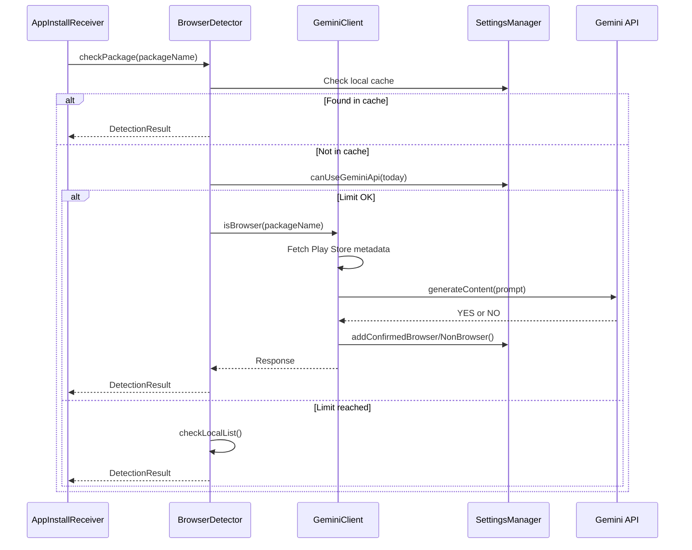

# Gemini AI Integration

Browser Limit integrates with Google Gemini Flash Lite to provide semantic classification of unknown applications. This allows the app to detect browsers that are not in the local `KNOWN_BROWSERS` database.

## How It Works

When a new app is installed and is not found in the local cache or known browser database, Browser Limit sends a request to the Gemini API. The API analyzes the app's package name and Play Store metadata to determine if it is a dedicated web browser.

## Model

- **Model**: `gemini-flash-lite-latest`
- **Endpoint**: `https://generativelanguage.googleapis.com/v1beta/models/gemini-flash-lite-latest:generateContent`
- **Temperature**: 0.0 (deterministic output)

## Classification Prompt

The prompt sent to Gemini is designed for strict classification:

**System Instruction:**

> You are an app capability detector. Respond with ONLY the word 'YES' or 'NO'. No explanations, no preamble, no markdown, no punctuation. ONLY YES or NO.

**User Prompt:**

> You are a strict App Capability Evaluator. Your job is to determine if the Android app with package name '[package_name]' is a DEDICATED WEB BROWSER or an app designed to allow UNRESTRICTED open internet browsing.
>
> Do NOT flag an app as YES just because it contains a WebView, opens help pages, or has a basic in-app browser for clicking links (e.g., standard social media apps like Facebook/Telegram, messaging apps, or utility apps).
>
> Answer YES ONLY if:
> 1. The app is a dedicated web browser (like Chrome, Firefox, Brave).
> 2. The app's primary purpose is proxying or unblocking websites.
> 3. The app is a video downloader or utility that explicitly features an unrestricted built-in browser with address bar for general web surfing.
>
> Answer NO for anything else, including regular apps, games, standard communication tools, or apps that only open specific links or safe in-app content.
>
> Reply with EXACTLY one word: YES or NO.

### Prompt Engineering Decisions

- **Play Store metadata**: The prompt includes the app's title and description scraped from the Play Store page. This gives Gemini context beyond just the package name.
- **Strict criteria**: The prompt explicitly excludes apps that merely contain a WebView or open specific links, reducing false positives.
- **Temperature 0.0**: Ensures deterministic output. The same input always produces the same classification.
- **System instruction**: Forces a single-word response, simplifying parsing.

## Play Store Scraping

Before sending the prompt, Browser Limit fetches the app's Play Store page to extract metadata:

```
https://play.google.com/store/apps/details?id={package_name}&hl=en
```

The app extracts:
- **Title** from the `<title>` tag
- **Description** from the `<meta name="description">` tag

This metadata is included in the Gemini prompt. If the Play Store page cannot be fetched (network error, app not on Play Store), the prompt uses only the package name.

:::note
Play Store scraping uses a desktop User-Agent header to avoid being blocked. The request has a 3-second timeout for both connection and read operations.
:::

## Response Parsing

The Gemini API response is parsed to extract a YES or NO classification. The parsing logic handles multiple formats:

```kotlin
if (response.contains("YES") && !response.contains("NO")) {
    // Classified as browser
} else if (response.contains("NO") && !response.contains("YES")) {
    // Classified as non-browser
} else if (response.contains("YES") || response.startsWith("YES") || 
           response.endsWith("YES.") || response.endsWith("YES")) {
    // Edge case: YES with extra text
} else if (response.contains("NO") || response.startsWith("NO") || 
           response.endsWith("NO.") || response.endsWith("NO")) {
    // Edge case: NO with extra text
} else {
    // Unexpected response: falls back to local database
}
```

The response is converted to uppercase before parsing. If the response is ambiguous (contains both YES and NO, or neither), the engine falls back to the local `KNOWN_BROWSERS` database.

## Daily Limit

To prevent excessive API usage, Browser Limit enforces a daily request limit:

| Setting | Value |
|---|---|
| **Daily limit** | 20 requests per day |
| **Reset** | Automatic at midnight (local time) |
| **Counter** | Stored in SharedPreferences (`gemini_api_count`) |
| **Date tracking** | Stored in SharedPreferences (`last_api_date`) |

When the daily limit is reached, the Dashboard shows "Gemini API: Limit Reached" and detection falls back to the local database.

:::tip
The daily limit resets automatically when the date changes. No manual intervention is required.
:::

## Error Handling

The Gemini client handles various error conditions:

| Error | Handling |
|---|---|
| **HTTP 429** (Too Many Requests) | Retries up to 3 times with exponential backoff (1s, 2s, 3s). If all retries fail, returns error. |
| **HTTP 401** (Unauthorized) | Returns "Invalid API key" error. Check your key in Settings. |
| **HTTP 403** (Forbidden) | Returns "Access denied" error. Your API key may not have Gemini API access enabled. |
| **HTTP 404** (Not Found) | Returns "Invalid endpoint" error. |
| **Socket timeout** | Returns "Gemini not responding (timeout)" error. |
| **Connection refused** | Returns "Connection refused" error. |
| **DNS failure** | Returns "Network failure" error. |
| **Empty response** | Returns "Empty Response" error. |

When any error occurs, the engine falls back to the local `KNOWN_BROWSERS` database for classification.

## Getting an API Key

1. Visit [Google AI Studio](https://aistudio.google.com/app/apikey).
2. Sign in with your Google account.
3. Create a new project (or select an existing one).
4. Click **Create API Key**.
5. Copy the key and paste it into the Browser Limit Settings screen.

:::note
Gemini API access is free for personal use with generous quotas. The 20 requests/day limit in Browser Limit is well within the free tier.
:::

## Configuration

| Setting | Location | Description |
|---|---|---|
| Gemini API Key | Settings | Your Google AI Studio API key |
| Use Gemini AI detection | Settings | Enable/disable the Gemini API |
| Test Gemini Connection | Settings button | Sends a test request for Chrome |

## Architecture


