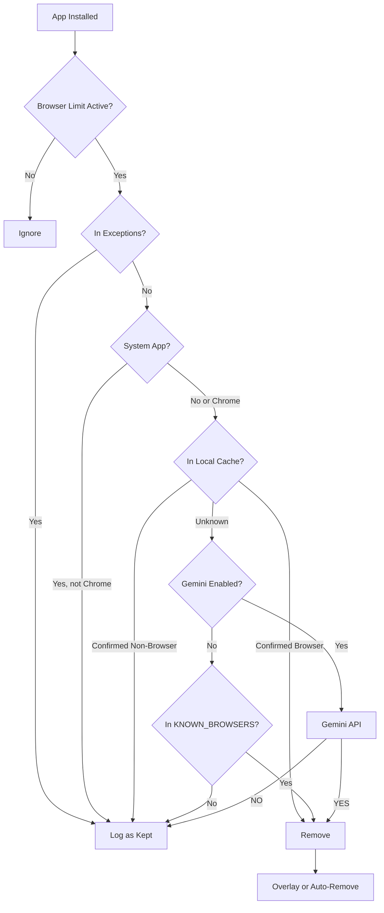

# Browser Limit

An Android application that automatically detects and removes web browsers from your device using Shizuku for rootless uninstallation and Gemini AI for semantic classification. Enforce digital minimalism with zero configuration.

## What It Does

Browser Limit monitors your device for newly installed applications. When a browser is detected, it is automatically uninstalled via Shizuku (a rootless package manager) or presented to you for manual confirmation. The detection engine uses a two-tier approach: a local database of known browser package names, and Google Gemini AI for semantic analysis of unknown apps.

## Key Features

- **Automated Uninstallation** -- Rootless removal via Shizuku API without requiring device root access.
- **AI-Powered Detection** -- Gemini Flash Lite classifies unknown apps by analyzing Play Store metadata and package semantics.
- **Two Detection Modes** -- Overlay mode (confirmation dialog with countdown) or auto-remove mode (silent uninstallation).
- **Parental Lock** -- PIN-protected configuration with optional waiting mode to prevent impulsive changes.
- **Offline Resilience** -- Local cache of confirmed browsers and non-browsers ensures operation without internet.
- **Audit Trail** -- Complete log of every detection decision, AI reasoning, and uninstallation result.

## At a Glance

| | |
|---|---|
| **Platform** | Android 8.0+ (API 26) |
| **Target SDK** | 36 (Android 16) |
| **License** | MIT |
| **Package** | `com.browserlimit.app` |

## Quick Start

1. [Install](getting-started.md) the APK from GitHub Releases.
2. Complete the 6-step onboarding wizard.
3. Grant required permissions (Shizuku, overlay, notifications).
4. Browser Limit monitors your device automatically.

## How Detection Works

## Documentation

- **[Getting Started](getting-started.md)** -- Installation, setup, and configuration.
- **[Detection System](detection.md)** -- How browser detection works.
- **[Gemini AI](gemini.md)** -- AI integration details and prompt engineering.
- **[Shizuku Integration](shizuku.md)** -- Rootless uninstallation setup.
- **[Parental Control](parental-control.md)** -- Parental lock and security settings.
- **[Exceptions](exceptions.md)** -- Managing the exception list.
- **[Audit Log](audit-log.md)** -- Log format, export, and retention.
- **[Architecture](architecture.md)** -- System design and data flow.
- **[API Reference](api-reference.md)** -- Class and schema documentation.
- **[Permissions](permissions.md)** -- Every Android permission explained.
- **[FAQ](faq.md)** -- Common questions and answers.
- **[Troubleshooting](troubleshooting.md)** -- Common issues and fixes.
