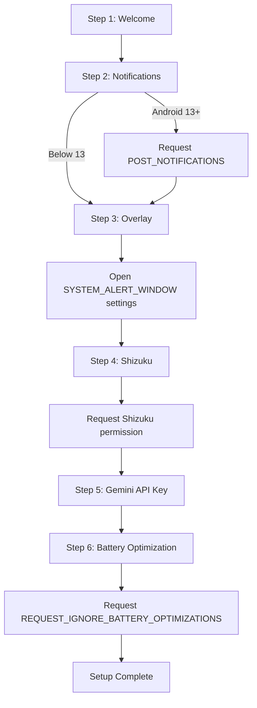

# Permissions

Browser Limit requests several Android permissions to function correctly. This page explains each permission, why it is needed, and whether it is required or optional.

## Permission Reference

| Permission | Purpose | Required |
|---|---|---|
| `INTERNET` | Make Gemini API calls and fetch Play Store metadata | Optional |
| `RECEIVE_BOOT_COMPLETED` | Start GuardService on device boot | Optional |
| `FOREGROUND_SERVICE` | Run the background monitoring service | Yes |
| `FOREGROUND_SERVICE_SPECIAL_USE` | Declare foreground service type as specialUse | Yes |
| ~~`REQUEST_INSTALL_PACKAGES`~~ | ~~Monitor new app installations~~ | ~~Yes~~ *(removed)* |
| `SYSTEM_ALERT_WINDOW` | Show overlay confirmation dialog | Required for overlay mode |
| `QUERY_ALL_PACKAGES` | Enumerate installed apps for detection | Yes |
| `POST_NOTIFICATIONS` | Show removal notifications and service notification | Android 13+ |
| `USE_BIOMETRIC` | Reserved for future biometric unlock | Reserved |
| `REQUEST_IGNORE_BATTERY_OPTIMIZATIONS` | Prevent system from killing the service | Recommended |
| `moe.shizuku.manager.permission.API_V23` | Communicate with Shizuku for rootless uninstall | Yes (via Shizuku) |

## Detailed Descriptions

### INTERNET

```
android.permission.INTERNET
```

Used for:
- Calling the Gemini API (`generativelanguage.googleapis.com`)
- Fetching Play Store metadata (`play.google.com`)

When disabled: Gemini AI detection is unavailable. Only the local `KNOWN_BROWSERS` database is used.

---

### RECEIVE_BOOT_COMPLETED

```
android.permission.RECEIVE_BOOT_COMPLETED
```

Used for:
- Starting the GuardService automatically when the device boots.
- Ensures monitoring begins immediately without manual app launch.

When disabled: The service does not start on boot. You must open Browser Limit manually after each restart.

---

### FOREGROUND_SERVICE

```
android.permission.FOREGROUND_SERVICE
```

Used for:
- Running the GuardService as a foreground service.
- The service registers the AppInstallReceiver to listen for new app installations.

This permission is required. Without it, Browser Limit cannot monitor for new installations.

---

---

### ~~REQUEST_INSTALL_PACKAGES~~ *(removed)*

This permission was previously declared but has been removed. The app never installs APKs — it only uninstalls via Shizuku (`pm uninstall`), so `REQUEST_INSTALL_PACKAGES` is unnecessary.

---

### SYSTEM_ALERT_WINDOW

```
android.permission.SYSTEM_ALERT_WINDOW
```

Used for:
- Displaying the OverlayActivity (full-screen confirmation dialog) when a browser is detected.
- The overlay shows over other apps to ensure the user sees the detection.

When disabled: Overlay mode is unavailable. Auto-remove mode still works.

---

### QUERY_ALL_PACKAGES

```
android.permission.QUERY_ALL_PACKAGES
```

Used for:
- Querying the PackageManager to get information about installed apps.
- Checking if an app is a system app.
- Getting the app label (display name) for logging.

This permission is required. Without it, Browser Limit cannot identify or classify apps.

:::note
This permission is restricted on Google Play. Browser Limit is distributed via GitHub Releases, so this restriction does not apply.
:::

---

### POST_NOTIFICATIONS

```
android.permission.POST_NOTIFICATIONS
```

Used for:
- Posting the GuardService foreground notification.
- Posting removal notifications when a browser is uninstalled.
- Required on Android 13 (API 33) and above.

When disabled: The service still runs but cannot display notifications. On Android 13+, the permission must be explicitly granted.

---

### USE_BIOMETRIC

```
android.permission.USE_BIOMETRIC
```

Reserved for future use. Currently not utilized by Browser Limit. Intended for biometric-based parental lock authentication.

---

### REQUEST_IGNORE_BATTERY_OPTIMIZATIONS

```
android.permission.REQUEST_IGNORE_BATTERY_OPTIMIZATIONS
```

Used for:
- Requesting exemption from Doze mode and App Standby.
- Ensures the GuardService is not killed by battery optimization.

When not granted: The system may kill the GuardService during battery optimization, stopping monitoring. The service may restart when the device is idle, but detection may be delayed.

---

### Shizuku Permission

```
moe.shizuku.manager.permission.API_V23
```

Used for:
- Communicating with the Shizuku service.
- Executing `pm uninstall` commands for rootless app removal.

This permission is managed by the Shizuku app. Browser Limit requests it during onboarding or when Shizuku is first needed.

---

## Permission Flow During Onboarding



## Granting Permissions Manually

If you skipped a permission during onboarding, you can grant it from the Dashboard:

1. Open Browser Limit.
2. The Dashboard shows an "Action Required" card with missing permissions.
3. Tap the corresponding "Fix" button to open the system settings for that permission.
4. Enable the permission.

You can also grant permissions via ADB:

```bash
# Notifications
adb shell pm grant com.browserlimit.app android.permission.POST_NOTIFICATIONS

# Overlay (requires manual toggle in settings)
adb shell appops set com.browserlimit.app SYSTEM_ALERT_WINDOW allow
```
